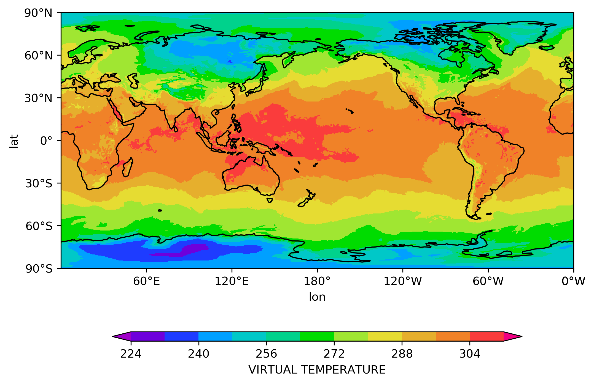
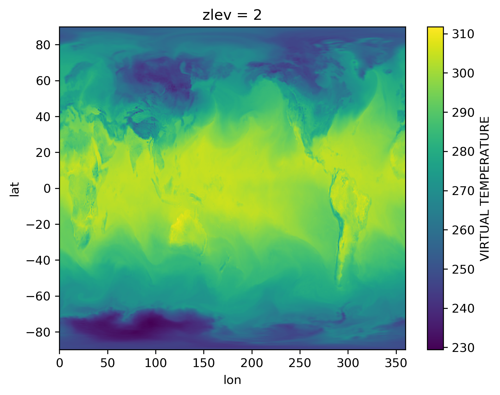
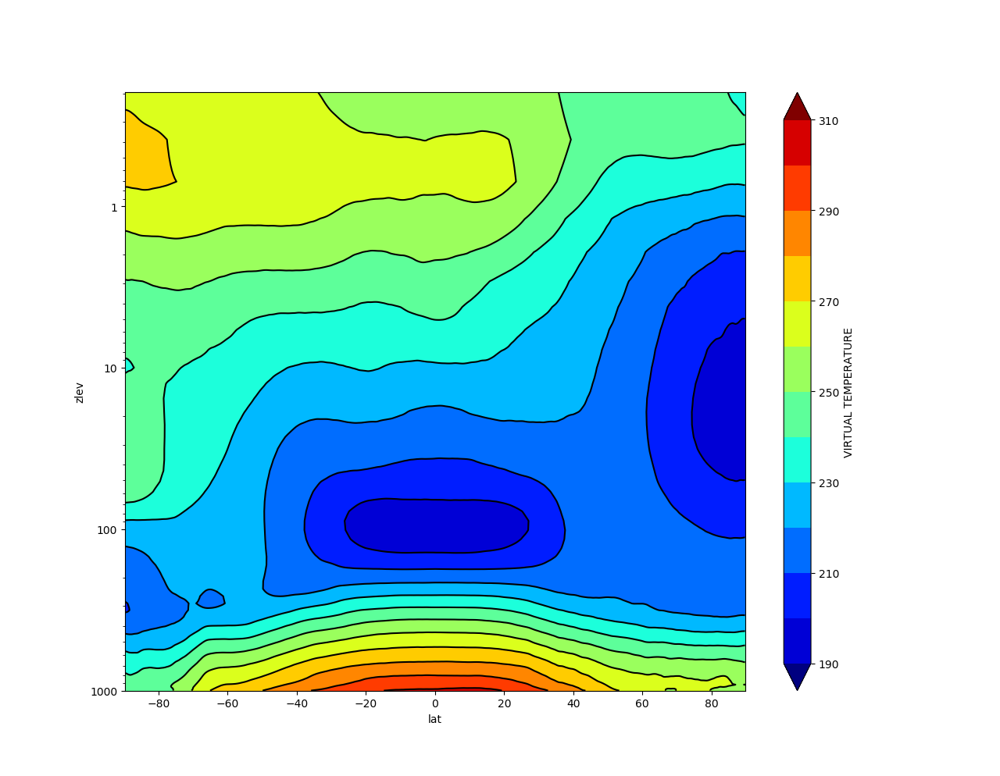

# Uso

Nos passos anteriores foi apresentada a forma de obtenção e instalação das dependências e o pacote pyBAM. A seguir será demostrado o uso básico do pacote.

O primeiro passo é carregar o pacote no ambiente Python. Uma vez que o ambiente Python já esteja em execução basta importar o pacote:

=== "Comando"

    ```bash linenums="1"
    python

    Python 3.7.6 (default, Jan  8 2020, 19:59:22) 
    [GCC 7.3.0] :: Anaconda, Inc. on linux
    Type "help", "copyright", "credits" or "license" for more information.
    >>>
    >>> import pyBAM as pb
    ```

Para a visualização de figuras é necessário carregar o pacote matplotlib:

=== "Comando"

    ```bash linenums="1"
    >>> import matplotlib.pyplot as plt
    ```

O pacote pyBAM lida diretamente com os arquivos espectrais gerados pelo modelo BAM. As variáveis no espaço espectral são recompostas para o espaço físico (ponto de grade) e são organizadas em estruturas de dados em 2 ou 3 dimensões utilizando a biblioteca xarray do Python.

Para acessar um arquivo do BAM basta informar o arquivo header correspondente. Por exemplo um arquivo de previsão é acessado informando o arquivo `dir`, a previsão de 0 horas (condição inicial) é acessada por meio do arquivo `dic`, já a condição inicial inicializada é acessada pelo arquivo `din`. No caso da condição inicial que é lida pelo modelo BAM pode ser acessada criando-se um arquivo header, semelhante aos arquivos de previsão, porém com o nome `dun`, por exemplo, `GANL2021021500.dun.TQ0299L064`. Então para acessar qualquer um destes arquivos é realizada a seguinte operação no ambiente Python (aqui será demonstrado com um arquivo de análise `icn`):

=== "Comando"

    ```bash linenums="1"
    >>> bFile = pb.openBAM('GFCTCPT20191115002019111500F.dic.TQ0299L064')
    ```

Para plotar uma variável em um determinado nível é realizada a seguinte operação:

=== "Comando"

    ```python linenums="1"
    >>> bFile.plotField('VIRTUAL TEMPERATURE', zlevel=1)
    ```

**Obs.:** se a opção `zlevel` for omitida será plotado o primeiro nível da variável.

Como resultado teremos o seguinte mapa:

=== "Resultado"

    

É possível obter campos 2D ou 3D para serem manipulados diretamente no Python, por exemplo, um campo 2D é obtido da seguinte forma:

=== "Comando"

    ```python linenums="1"
    >>> field = bFile.getField('VIRTUAL TEMPERATURE', zlevel=55)
    ```

Desta forma a variável `field` conterá um xarray com a temperatura virtual no nível 55:

=== "Comando"

    ```python linenums="1"
    >>> field = bFile.getField('VIRTUAL TEMPERATURE', zlevel=55)
    >>> print(field)
    ```

=== "Resultado"

    ```python linenums="1"
    <xarray.DataArray 'VIRTUAL TEMPERATURE' (lat: 450, lon: 900)>
    array([[195.43694, 195.43604, 195.43513, ..., 195.43967, 195.43877,
            195.43785],
           [195.54573, 195.54234, 195.53894, ..., 195.5558 , 195.55246,
            195.5491 ],
           [195.70177, 195.6979 , 195.694  , ..., 195.71307, 195.70935,
            195.70558],
           ...,
           [240.0018 , 239.99652, 239.99113, ..., 240.01709, 240.01208,
            240.00699],
           [239.82939, 239.82619, 239.82297, ..., 239.83885, 239.83572,
            239.83257],
           [239.6583 , 239.65721, 239.65614, ..., 239.66148, 239.66042,
            239.65936]], dtype=float32)
    Coordinates:
      * lat      (lat) float32 89.69 89.3 88.9 88.5 ... -88.5 -88.9 -89.3 -89.69
      * lon      (lon) float32 0.0 0.4 0.8 1.2 1.6 ... 358.0 358.4 358.8 359.2 359.6
    >>>
    ```

Por outro lado, para obter campos 3D utiliza-se o método `getField3D`. Pelo fato dos arquivos estarem no espaço espectral é necessária a conversão para o espaço físico, e este processo leva um pouco de tempo e depende da máquina onde está sendo executado:

=== "Comando"

    ```python linenums="1"
    >>> field3D = bFile.getField3D('VIRTUAL TEMPERATURE')
    VIRTUAL TEMPERATURE  has  64  zlevels
    This operation will take a while ...
    100%|===================================================|64/64 [01:48<00:00,  1.69s/it]
    >>> print(field3D)
    ```
=== "Resultado"

    ```python linenums="1"
    <xarray.DataArray 'VIRTUAL TEMPERATURE' (zlev: 64, lat: 450, lon: 900)>
    array([[[252.69609, 252.69844, 252.70079, ..., 252.68913, 252.69144,
             252.69376],
            [252.21732, 252.22253, 252.22774, ..., 252.20169, 252.2069 ,
             252.21211],
            [251.98215, 251.9921 , 252.00203, ..., 251.95232, 251.96225,
             251.9722 ],
            ...,
            [248.31041, 248.29773, 248.28464, ..., 248.34602, 248.33456,
             248.3227 ],
            [247.39056, 247.38445, 247.37819, ..., 247.4079 , 247.40228,
             247.3965 ],
            [246.86551, 246.86342, 246.86131, ..., 246.8717 , 246.86966,
             246.86758]],
    ...
            [272.3629 , 272.36194, 272.36096, ..., 272.36588, 272.3649 ,
             272.3639 ],
            [272.41965, 272.41913, 272.4186 , ..., 272.4212 , 272.4207 ,
             272.42017],
            [272.4776 , 272.47736, 272.4771 , ..., 272.47833, 272.4781 ,
             272.47784]],
    
           [[239.36282, 239.36331, 239.3638 , ..., 239.36139, 239.36186,
             239.36234],
            [239.29114, 239.29208, 239.29305, ..., 239.28831, 239.28925,
             239.29018],
            [239.23221, 239.23349, 239.23477, ..., 239.22847, 239.2297 ,
             239.23096],
            ...,
            [268.84753, 268.8466 , 268.84564, ..., 268.85037, 268.84943,
             268.84848],
            [268.90298, 268.90225, 268.90155, ..., 268.90512, 268.9044 ,
             268.9037 ],
            [268.95297, 268.9526 , 268.9522 , ..., 268.95416, 268.95377,
             268.95337]]], dtype=float32)
    Coordinates:
      * lat      (lat) float32 89.69 89.3 88.9 88.5 ... -88.5 -88.9 -89.3 -89.69
      * lon      (lon) float32 0.0 0.4 0.8 1.2 1.6 ... 358.0 358.4 358.8 359.2 359.6
      * zlev     (zlev) int64 1 2 3 4 5 6 7 8 9 10 ... 55 56 57 58 59 60 61 62 63 64
    ```

Como as variáveis `field` e `field3D` são estruturas de dados do tipo xarray, elas carregam com si todas as funcionalidades do pacote XArray. Para plotar qualquer um dos níveis da variável `field3D` basta executar a seguinte instrução:

=== "Comando"

    ```python linenums="1"
    >>> field3D.sel(zlev=2).plot()
    ```

O que resulta na seguinte imagem:

=== "Resultado"

    

É possível aplicar outros métodos do xarray, como por exemplo calcular a média zonal da variável e então plotar o resultado:

=== "Comando"

    ```python linenums="1"
    >>> zonal_mean = field3D.mean(dim='lon')
    >>> zonal_mean.plot.contourf(levels=13, yincrease=False, cmap='jet', extend='both')
    >>> zonal_mean.plot.contour(levels=13, yincrease=False, colors='k')
    >>> plt.yscale('log')
    >>> plt.gca().yaxis.set_major_formatter(mpl.ticker.ScalarFormatter()
    >>> plt.show()
    ```

O que deve resultar na seguinte imagem:

=== "Resultado"

    
